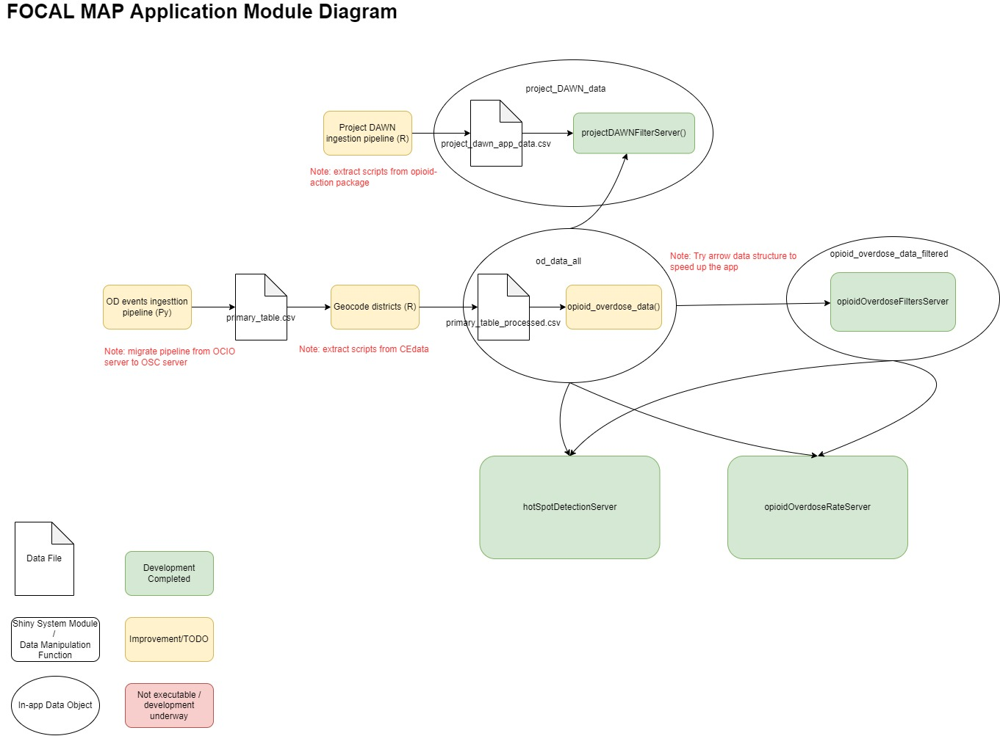

<!-- README.md is generated from README.Rmd. Please edit that file -->

```{r, include = FALSE}
knitr::opts_chunk$set(
  collapse = TRUE,
  comment = "#>",
  fig.path = "man/figures/README-",
  out.width = "100%"
)
```

# opioidDashboard

<!-- badges: start -->
<!-- badges: end -->

The goal of opioidDashboard is to ...

## Installation

You can install the development version of opioidDashboard like so:
First, clone this repo to your server.
Then, open the repo and type the following command

``` r
library(devtools)
devtools::load_all()
devtools::install()
```
You can run the app in your local session by using the `app_dev()` function.

## Modules

